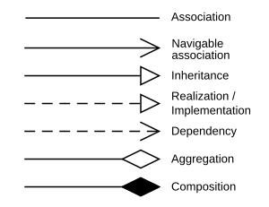

---
authors:
  - name: Student Name
    studentid: s123456
  - name: Student Name
    studentid: s654321
contributions:
  - introduction:
        s123456: 100
  - problem-statement:
        s654321: 75
        s123456: 25
  - design:
        s123456: 100
  - implementation:
        s654321: 75
        s123456: 25
  - validation:
        s123456: 100
  - discussion:
        s654321: 25
        s123456: 75
...

# Rapport

Dette er en vejledende og løs beskrivelse af, hvad der skal være i en god rapport.

**Rapportens opgave er at være et spejl af jeres produkt.**
Formålet ved rapporten er derfor til dels at sælge hvad I har lavet så godt som muligt.

De følgende sektioner er opdelt lidt ligesom en rapport ville være.

### Indledning

> _Hvem, Hvorfor, og Hvordan skal man læse rapporten?_

Kort sagt, har indledningen formålet at sætte kontekst og forventningerne til resten af rapporten.
En dårlig indledning giver derfor ofte et dårlig indtryk; som I så skal kæmpe jer tilbage fra i resten af rapporten.

Ting der er gode at få med:

- [ ] Sæt rapporten in kontekst. Hvad forventer I at jeres læser kan forstå?
- [ ] En kort beskrivelse af hvad I har lavet og er specielt stolte af, gerne med referencer til resten af rapporten.

### Kravsanalyse / Problemet

> _Hvad er problemet?_

I denne sektion skal I forklare det problem I arbejder med.
I jeres tilfælde er det programmet, kundens behov, samt en gennemgang af de user stories I har.

Siden vi bruger User Stories er der ikke nogen grund til at præsentere jeres krav på andre måder.

Ting der er gode at få med:

- [ ] En navneords analyse sådan vi ved, hvad de ord, kunden bruger, betyder.
  - Her kan I bruge et domain diagram.
- [ ] En analyse af hvilke roller (brugere) der eksisterer.
  - Designer?, Animator?
- [ ] En forklaring af hvordan brugen af et tegneprogram er.
  - Her kan I bruge et aktivitet diagram.
  - Dette hedder ofte AS-IS (som det er) som er i kontrast til TO-BE (som det skal være).
- [ ] En prioritering af User Stories.
  - Her kan I gøre brug af MoSCoW.
  - I kan også inddele dem i funktionelle, kvalitets og udviklings-mæssige krav.
- [ ] En diskussion af hvad kundesnakken har ændret.

### Planlægning og Design

> _Hvordan kan vi løse det?_

Der er to dele til denne del, en beskrivelse af det system som I vil udvikle, men også en prioritering sådan at ting bliver udviklet i den rigtige orden.

Ting der er gode at få med:

- [ ] Brudt User Stories ned i delsystemer.
  - Et delsystem er noget som er mere koblet end resten.
  - Bevægelse / Fængsel / Prøv Lykken / .. osv.
- [ ] En beskrivelse af planlægningen.
  - Hvilke user stories afhænger af hvilke og er der tid nok til at nå de forskellige user stories.
  - Måske bruge et Gantt' Diagram.
- [ ] En beskrivelse af hvordan planen har ændret sig over tid.
- [ ] En beskrivelse af arkitekturen (pakke niveau).
  - Hvordan har I brudt jeres kode op i pakker sådan at I får høj sammenhæng og lav coupling.
  - Har I designet delsystemer sådan at I kan arbejde på dem parallelt?
  - Har I gjort jer nogle ideer omkring test.
- [ ] En beskrivelse af de delsystemer I vil udvikle.
  - Her kan I bruge aktivitet og sekvens diagrammer til at beskrive opførsel hvis den er anderledes
    end AS-IS.

### Implementering

> _Hvad fik vi lavet?_

Denne sektion er dedikeret til at beskrive hvad I har lavet.

Ting der er gode at få med:

- [ ] En forklaring af hvilke user stories I har nået, og på hvilke tidspunkter.
- [ ] En liste over de værktøjer, biblioteker, og ekstern kode I har brugt med versioner.
  - Java version, GUI_Library, IDE version, osv.
- [ ] En beskrivelse af hvordan man kører jeres kode.
- [ ] Et overblik over koden.
  - Her kan I bruge et klasse diagram til at beskrive hvordan det ser ud.
- [ ] En gennemgang af de patterns I har gjort brug af.
  - Dependency Inversion/Injection, MVC, Observer Pattern, GoF, osv...
  - Her kan I bruge klasse diagrammer og sekvens diagrammer.
- [ ] En forklaring af specielet interessant eller vigtig kode.
  - Her kan I bruge sekvens diagrammer, tilstands diagrammer, eller kode eksempler.

Husk at bruge de rigtige pile i klasse-diagrammet (By Yanpas - Own work, [CC BY-SA 4.0](https://commons.wikimedia.org/w/index.php?curid=48015014)):

### Validering

> _Virker det?_

I denne sektion skal I forklare hvorfor I tænker at koden I har afleveret virker.
I kan beskrive hvilke ekstra steps I har taget for at få accepttest til at kører nemt.

Ting der er gode at få med:

- [ ] En beskrivelse af hvilke systemer som koden er blevet testet på.
  - Linux, MacOSX, Windows?
  - Versioner af Java?
- [ ] En gennem gang af de accepttest der lykkedes og ikke lykkedes.
- [ ] En forklaring af brug af unit-test og code coverage.
  - Screen shots fra jeres IDE med code coverage.

### Diskussion

> _Hvad har vi lært?_

I denne sektion er en refleksion over hvad I mangler, hvordan gruppearbejdet er gået og hvad I gerne vil have lavet, hvis I har haft mere tid.
Dette er et godt sted at rede en karakter, hvis man har lavet nogle fejl :).

Ting der er gode at få med:

- [ ] Hvad gik godt, hvad gik dårligt?
- [ ] Næste gang, hvad ville I gøre anderledes?
- [ ] Hvad har I lært?

### Arbejdfordeling og Brug af AI

> _Hvem gjorde hvad?_

I denne sektion skal I redegøre for hvem der har gjort hvad. 
I **SKAL** fortælle hvordan/hvis I har brugt AI.

Ting der er gode at få med:

- [ ] Er I enige med den contribution score I har fået? Hvis ikke, hvorfor? Giv gerne konkrete eksempler, og en alternativ fordeling.
- [ ] Er der arbejde der ikke er blevet reflekteret diverse contribution scores så skal I næve det her.

